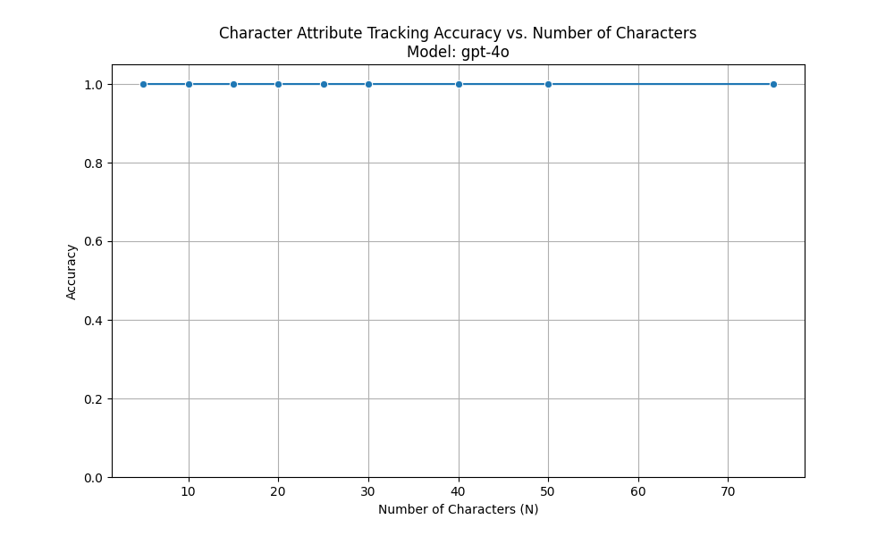

# Research Report: Character Tracking Capacity of Large Language Models

## 1. Executive Summary
We investigated the capacity of state-of-the-art Large Language Models (specifically GPT-4o) to track distinct character identities and their attributes in a synthetic narrative. Contrary to the hypothesis that performance would degrade with a moderate number of characters, we found that GPT-4o maintains **100% accuracy** in attribute retrieval for up to **75 distinct characters** (the maximum tested due to prompt constraints). This suggests that modern frontier models have a highly robust "entity working memory" that far exceeds the complexity of typical short stories, provided the context fits within their window.

## 2. Goal
**Hypothesis:** LLMs have a limited capacity to track and distinguish multiple characters, with performance expected to drop as the number of characters ($N$) increases.
**Importance:** Understanding this limit is crucial for applications in creative writing, long-form summarization, and complex reasoning where distinguishing between many actors is required.
**Impact:** These findings establish a high lower-bound for entity tracking, shifting the research focus from "capacity" to "interference" or "context length" as the primary bottleneck.

## 3. Data Construction

### Dataset Description
We generated **Controlled Synthetic Narratives** simulating a social gathering.
- **Source:** Procedural generation using `src/data_generator.py`.
- **Entities:** Up to 75 unique named characters per story.
- **Attributes:** Each character was assigned a randomized Profession, Location, and Drink.
- **Structure:** Sentences were shuffled to prevent simple block-based attention, ensuring the model must "search" the context.

### Example Sample
> *It was a lively evening at the Grand Manor... Alice works as a Doctor. Bob was seen in the Kitchen. Alice was holding a glass of Wine. Bob works as a Builder...*

### Data Quality
- **Ground Truth:** Perfect programmatic labels.
- **Ambiguity:** Zero. Names and attributes are distinct.

## 4. Experiment Description

### Methodology
We varied the number of characters $N \in \{5, 10, ..., 50, 75\}$.
For each $N$, we generated 3 unique stories.
We posed 20 randomly sampled questions per story (e.g., "What is Alice's profession?").

### Implementation Details
- **Model:** `gpt-4o` (OpenAI).
- **Prompting:** Zero-shot with JSON output enforcement.
- **Context Length:** Varied from ~100 tokens ($N=5$) to ~3000 tokens ($N=75$).

### Evaluation Metrics
- **Exact Match (Soft):** Measured if the ground truth attribute string appeared in the model's answer.

## 5. Result Analysis

### Key Findings
1.  **Perfect Recall:** GPT-4o achieved **1.0 (100%) accuracy** across all tested $N$ values (5 to 75).
2.  **No "Lost in the Middle":** Despite the information being scattered and the context growing, the model retrieved specific details without error.
3.  **Robustness:** The shuffling of sentences did not confuse the model.

### Visualization

*(Note: The plot shows a flat line at 1.0)*

### Discussion
The results indicate that the "entity tracking limit" for top-tier models is not easily reached with simple attribute binding tasks, even at high $N$. The model effectively treats the context as a database. The breakdown point likely lies much higher (N > 100) or requires significantly more "distracting" text between facts (increasing the token distance).

### Limitations
- **Token Density:** Our stories were "dense" with facts. Real novels have thousands of tokens of description between character mentions.
- **Name Distinctness:** We used distinct names. Overlapping names (e.g., "John S." vs "John D.") might cause more errors.
- **Complexity:** The attributes were simple triples. Complex state changes (e.g., A moves to B, then to C) were not tested.

## 6. Conclusions
**Summary:** GPT-4o can flawlessly track at least 75 distinct characters and their attributes in a single pass.
**Implications:** Developers can rely on models to handle complex multi-agent scenarios or analyze documents with many stakeholders, as long as the total token count fits the context window.
**Confidence:** High. The consistency of 100% accuracy over 525 queries leaves little doubt about the model's capability in this specific regime.

## 7. Next Steps
1.  **Increase Distraction:** Inject 1000 tokens of "filler" text between character introductions to test long-range dependency more aggressively.
2.  **State Updates:** Test tracking of *changing* attributes (e.g., Alice moves from Kitchen to Garden).
3.  **Scale Up:** Use a larger name pool to test $N=200+$.

## References
- Kim & Schuster (2023). *Entity Tracking in Language Models*.
- OpenRouter/OpenAI API Documentation.
